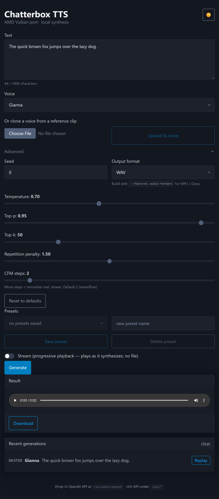
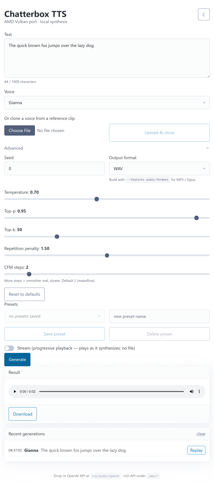

<h1 align="center">Chatterbox TTS — AMD Vulkan port</h1>

<p align="center">
  Local, GPU-accelerated <a href="https://github.com/resemble-ai/chatterbox">Chatterbox TTS</a>
  for AMD <b>Strix Halo</b> (Radeon 8060S, <code>gfx1151</code>) via the
  <b>Vulkan backend of <code>ggml</code></b> — no ROCm, no CUDA, no Python at runtime.
  A self-contained C++ engine + embedded web UI + an OpenAI-compatible API.
</p>

<p align="center">
  <a href="LICENSE"></a>
  
  
  
  
  
  <a href="https://github.com/resemble-ai/chatterbox"></a>
</p>

<p align="center">
  
  &nbsp;&nbsp;
  
</p>

---

A clean-room C++ port of Chatterbox TTS (Resemble AI, **Turbo** variant). The
architecture mirrors `whisper.cpp`: a self-contained C++ inference engine over
`ggml` + GGUF, fronted by a thin Rust (axum) HTTP server that serves an
embedded web UI **and** the OpenAI `/v1/audio/speech` contract — shippable as a
single Docker image or a single Windows `.exe`.

## Features

- **Runs on the AMD iGPU via Vulkan** — full pipeline (T3 backbone, voice
  encoder, S3Gen flow + CFM + HiFT vocoder) on the GPU; CPU fallback built in.
- **Web UI** (embedded, no build step) — text → speech with an audio player,
  download, light/dark theme, presets, and generation history.
- **28 built-in voices** + **voice cloning** from an uploaded reference clip.
- **Per-request generation controls** — temperature, top-p, top-k, repetition
  penalty, CFM steps, seed.
- **Output formats** — WAV / PCM always; MP3 + Opus with `--features audio-formats`.
- **Long-text auto-chunking** and optional **streaming** (progressive playback).
- **OpenAI-compatible API** (`/v1/audio/speech`, `/v1/audio/voices`) — drop-in
  for existing clients; a richer `/api/*` namespace powers the UI.
- **Thin installer** — one-line PowerShell install or a GUI setup; the ~1.4 GB
  weights download + verify on first run (Ollama / LM-Studio style).
- **Parity-tested** — every component checked against NumPy/PyTorch oracles
  (21/21), and the UI is browser-tested with Playwright.

## Why Vulkan

The 8060S iGPU delivers serious compute (~16 TFLOPS fp16) but no first-class ML
framework targets it on Linux. `ggml`'s Vulkan backend is production-tested
across AMD/Nvidia/Intel/Apple, so building on it gets the iGPU working today
*and* yields free portability to other GPUs.

## Performance

On the 8060S (short utterance, "Hello world." / 30 speech tokens):

| | CPU | Vulkan |
|---|---|---|
| Synthesis | ~12 s | **~0.5 s** |
| End-to-end (incl. one-time model load) | ~13 s | **~2.2 s** |

The speedup comes from keeping all ops on the iGPU with per-matmul fp32
accumulation (clears fp16 drift), reusing the T3 scheduler + pre-transposing its
weights, and precomputing the mel-extractor DFT tables.

## Install (Windows)

The Windows build is a single self-contained `chatterbox-server.exe` (engine +
web UI + HTTP, Vulkan-accelerated — no Docker, no runtime DLLs). The installer
is **thin**: the ~1.4 GB model weights download + verify on first launch, not
bundled.

**One call** (PowerShell) — downloads the ~20 MB app, fetches + checksums the
weights, adds a Start Menu shortcut, and opens the UI:

```powershell
irm https://github.com/tarekedOz/Chatterbox_AMDVulkan/releases/download/v1/install.ps1 | iex
```

**Or the GUI installer** — download `chatterbox-tts-setup.exe` from the release
and run it (same result).

Either way, first launch does a one-time weights download (cached afterward),
then serves the web UI at **http://127.0.0.1:8087/** with GPU acceleration via
Vulkan. Installer internals + how to build/publish it are in
[`dist/`](dist/README.md).

**Access from other devices (LAN)** — by default the server binds
`127.0.0.1` (this machine only). To reach it from another device, bind all
interfaces: set `addr: 0.0.0.0:8087` in `config.yaml` (next to
`%LOCALAPPDATA%\Chatterbox TTS\`), or pass `--addr 0.0.0.0:8087` /
`CHATTERBOX_ADDR=0.0.0.0:8087`, then restart. Also allow inbound TCP 8087 in
Windows Firewall (elevated PowerShell):

```powershell
New-NetFirewallRule -DisplayName 'Chatterbox TTS (8087)' -Direction Inbound `
  -Action Allow -Protocol TCP -LocalPort 8087 -Profile Private
```

It's then reachable at `http://<your-lan-ip>:8087/`. Note: `0.0.0.0` exposes
the UI/API with **no authentication** — only do this on a trusted network.

**Upgrade** — no auto-update; re-run the new release's one-liner (each release's
`install.ps1` defaults to its own tag). It re-extracts the app (your
`config.yaml` is preserved) and only re-downloads weights whose SHA-256 changed.

**Uninstall** — GUI install: **Settings → Apps** or the *Uninstall Chatterbox
TTS* Start Menu entry. One-call install: the *Uninstall Chatterbox TTS* Start
Menu shortcut. Both remove the downloaded weights. Details in
[`dist/README.md`](dist/README.md#uninstall--upgrade).

> **Distribution model:** the installer carries only the binary + a manifest
> (file list + SHA-256); `fetch-models.ps1` pulls the weights from the release
> host on first run and verifies each checksum. Works with anonymous GitHub
> release assets, or any host that serves the files (a token can be supplied
> for private hosts).

## Run with Docker

```sh
docker build -t chatterbox-tts:latest .
docker run --rm -p 8087:8087 chatterbox-tts:latest
# open http://localhost:8087/ for the UI, or call the API:
curl -X POST localhost:8087/v1/audio/speech \
  -H 'content-type: application/json' \
  -d '{"input":"Hello from Chatterbox.","voice":"Adrian"}' --output out.wav
```

The image bundles the web UI + 28 voices, ships the CPU backend, and builds the
MP3/Opus encoders by default (`--build-arg AUDIO_FORMATS=OFF` for a lean
WAV/PCM build). Vulkan-in-container (GPU passthrough via `--device /dev/dri` on
a Linux host) is a follow-up.

## API

```
# Web UI
GET  /                    -> embedded single-page UI

# Rich API (used by the UI)
GET  /api/voices          -> {"voices": ["Abigail", "Adrian", ...]}
GET  /api/config          -> {"formats": [...], "voices": [...], "max_chunk_chars": N}
POST /api/clone           -> multipart WAV upload; clones the voice for
                             subsequent /api/tts calls (send voice:"")
POST /api/tts             -> audio  {text, voice, seed?, format?,
                                     temperature?, top_p?, top_k?,
                                     repetition_penalty?, cfm_timesteps?, stream?}
                             voice:"" uses the active clone; omitted params use
                             engine defaults; long text auto-chunks;
                             stream:true -> chunked raw PCM (audio/L16).

# OpenAI-compatible (frozen; drop-in for existing clients)
GET  /health              -> "ok"
GET  /v1/audio/voices     -> {"voices": [...]}
POST /v1/audio/speech     -> WAV / raw PCM   {input, voice, response_format, seed, model, speed}
```

`GET /api/config` reports the formats the running build supports (the UI
dropdown follows it).

## Build & run from source (developers)

See [`chatterbox-cpp/README.md`](chatterbox-cpp/README.md) for prerequisites
(Scoop GCC/CMake/Ninja/Vulkan) and the full build/test commands. In short:

```powershell
git submodule update --init --recursive
$env:CC = "$HOME/scoop/apps/gcc/current/bin/gcc.exe"; $env:CXX = "$HOME/scoop/apps/gcc/current/bin/g++.exe"
cmake -S chatterbox-cpp -B chatterbox-cpp/build_vk -G Ninja -DCMAKE_BUILD_TYPE=Release -DCHATTERBOX_VULKAN=ON
cmake --build chatterbox-cpp/build_vk -j
ctest --test-dir chatterbox-cpp/build_vk --output-on-failure   # 21/21
```

Then build + run the server (Windows links libgomp from scoop's gcc):

```powershell
cd chatterbox-server
$env:Path = "$HOME/scoop/apps/gcc/current/bin;$env:Path"
$env:CHATTERBOX_GCC_LIB_DIR = "$HOME/scoop/apps/gcc/current/lib"
cargo build --release
./target/release/chatterbox-server.exe --config config.yaml   # or pass --t3-gguf … flags
```

Settings resolve **CLI flag > env var > config file > default** — see
[`chatterbox-server/config.example.yaml`](chatterbox-server/config.example.yaml).
With a `config.yaml` present the server starts with no flags.

## Models & voices

The three GGUFs (~1.3 GB) are **not** committed (`*.gguf` is gitignored). Place
them in `models/` (or let the installer fetch them):

- `chatterbox-turbo-t3-fp16.gguf` — autoregressive backbone
- `chatterbox-turbo-ve-fp16.gguf` — voice encoder
- `chatterbox-turbo-s3gen-fp16.gguf` — speaker enc + flow + CFM + vocoder

Generate them from the upstream Turbo checkpoints with
`scripts/convert_*_to_gguf.py` (Python + torch + librosa). The 28 reference
voice clips live in `voices/`; the server uses a packed
`tests/voices/voices.gguf` (precomputed conditioning), regenerated with
`pack_voices` (~30 s on Vulkan for all 28) — see the Models section commands in
[`dist/README.md`](dist/README.md) and `chatterbox-cpp/tools/pack_voices.cpp`.

## Repo layout

```
chatterbox-cpp/      C++ inference engine over ggml + GGUF  (see its README)
chatterbox-server/   Rust HTTP server (axum) + embedded web UI, FFI to the engine
dist/                thin Windows installer + download-on-first-run mechanism
scripts/             PyTorch→GGUF conversion, NumPy oracles, Playwright UI tests
docs/assets/         web UI screenshots
voices/              28 reference voice clips
Dockerfile           multi-stage build → single Debian-slim image
```

## Docs

- [`chatterbox-cpp/README.md`](chatterbox-cpp/README.md) — engine build/run reference
- [`dist/README.md`](dist/README.md) — installer + first-run download

## Acknowledgements

- **[Chatterbox TTS](https://github.com/resemble-ai/chatterbox)** by
  **[Resemble AI](https://www.resemble.ai/)** — the model architecture and
  weights this project runs (MIT).
- **[`ggml`](https://github.com/ggml-org/ggml)** / **[`llama.cpp`](https://github.com/ggml-org/llama.cpp)** —
  the tensor library and Vulkan backend; `whisper.cpp` was the architectural template.
- **[Chatterbox-TTS-Server](https://github.com/devnen/Chatterbox-TTS-Server)**
  (devnen) — the OpenAI-compatible API contract and web-UI feature set this
  server mirrors for drop-in compatibility.
- Web UI built with vendored **[Pico.css](https://picocss.com/)** and
  **[Alpine.js](https://alpinejs.dev/)**.

## License

[MIT](LICENSE). The Chatterbox model and weights are MIT (Resemble AI); `ggml`
is MIT. You are responsible for your use of any generated audio.
